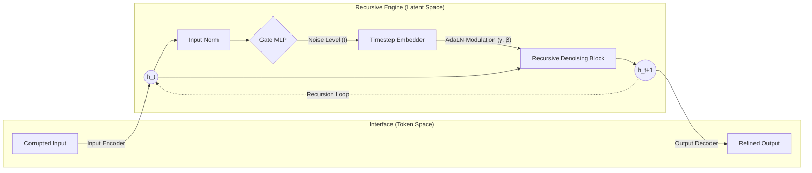

# RDT: Recursive Denoising Transformer

> **An Iterative Text Refinement Framework via Latent Space Denoising**

[](https://opensource.org/licenses/MIT)
[](https://www.python.org/downloads/)
[](https://pytorch.org/)
[](https://arxiv.org/)

**Recursive Denoising Transformer (RDT)** proposes a novel architecture that bridges the gap between **Autoregressive Transformers** and **Denoising Diffusion Models**. Unlike traditional BERT-like models that process input in a single pass, RDT employs a **state-aware recursive mechanism** to iteratively refine text representations within a continuous latent space.

By leveraging **Adaptive Layer Normalization (AdaLN)** and a self-regulating **Gate Mechanism**, RDT dynamically modulates its computation path. This allows for parameter-efficient deep computation, enabling the model to reconstruct complex semantic structures from heavily masked inputs through successive "denoising" iterations.

---

## 🧩 Methodology

### 1. Latent Space Denoising
RDT fundamentally differs from standard MLMs by separating the generation process into **Latent Mapping** and **Latent Denoising**.
*   **Interface (Encoders/Decoders)**: Acts as a bridge between discrete tokens and continuous vectors.
*   **Engine (Recursive Block)**: Performs the restoration trajectory ($h_t \to h_{t+1}$) entirely within the latent space, effectively removing "semantic noise" without observing raw tokens.

$$
h_{t+1} = \mathcal{F}_\theta(h_t, \text{Emb}(g_t))
$$

### 2. Model Architecture

The architecture mimics a **Latent Diffusion** process adapted for discrete text via recursive computation.



#### A. Adaptive Layer Normalization (AdaLN)
To effectively reuse weights across different denoising stages, the model injects timestep information into the normalization layers. The affine parameters are dynamically generated based on the Gate's output:
$$ \text{AdaLN}(x, t) = (1 + \gamma(t)) \cdot \text{LayerNorm}(x) + \beta(t) $$
We employ a **Zero-Initialization** strategy for $\gamma$ and $\beta$, ensuring the recursive block starts as an identity function and gradually learns to modulate features.

#### B. Differential Gate Mechanism
RDT includes a lightweight **Gate MLP** that acts as an internal clock. It diagnoses the entropy of the current hidden state to predict the restoration progress using a **Residual Prediction** scheme:
$$ g_{t} = g_{t-1} - \Delta(h_t, h_{t-1}) $$
This ensures a monotonically decreasing noise estimate, preventing infinite loops during inference.

---

## 📉 Optimization Objectives

The training optimizes a multi-task objective ensuring structural integrity and temporal coherence:

$$ \mathcal{L}_{total} = \mathcal{L}_{recon} + \lambda_{gate}\mathcal{L}_{gate} + \lambda_{latent}\mathcal{L}_{latent} $$

| Component | Symbol | Description |
| :--- | :---: | :--- |
| **Reconstruction** | $\mathcal{L}_{recon}$ | Cross-Entropy loss on the final logits. Ensures the latent state decodes to correct tokens. |
| **Gate Consistency** | $\mathcal{L}_{gate}$ | MSE loss ensuring the Gate MLP accurately estimates the ground-truth noise level ($s_{GT}$). |
| **Latent Consistency** | $\mathcal{L}_{latent}$ | **Key Component.** Minimizes distance between recursive state $h_t$ and the "ideal" state encoded from ground-truth text. Acts as **Teacher Forcing in Latent Space**. |

---

## 📂 Project Structure

The project is organized to separate model architecture, training logic, and data processing.

```bash
rdt/
├── models/              # Core Neural Architectures
│   ├── rdt_model.py        # Main RDT Implementation
│   │   ├── DirectionalRecursiveBlock  # Shared Denoising Block
│   │   ├── AdaptiveLayerNorm          # Time-conditioned Norm
│   │   └── GateMLP                    # Residual Time Estimator
│   ├── baseline_models.py  # BERT/RoBERTa wrappers
│   └── bert_init.py        # Weight initialization tools
│
├── training/            # Training Logic
│   ├── rdt_trainer.py      # RDT Trainer
│   │   ├── Latent Consistency Loss    # Auxiliary loss implementation
│   │   └── Scheduled Sampling         # GT vs Predicted Gate curriculum
│   └── baseline_trainer.py # Standard MLM Trainer
│
├── data/                # Data Pipeline
│   ├── datasets.py         # StreamingTextDataset
│   └── collators.py        # Chain generation ($s_0 \to s_L$) & Masking
│
├── scripts/             # CLI Entry Points
│   ├── train.py            # Unified training script
│   ├── inference.py        # Adaptive inference demo
│   └── evaluate.py         # Evaluation metrics calculation
│
└── configs/             # Hyperparameter Configurations
    ├── base.yaml           # Default RDT config
    └── experiment.yaml     # Custom experiment setups
```

---

## 🛠️ Installation

1. **Clone the repository:**
   ```bash
   git clone https://github.com/yourusername/rdt.git
   cd rdt
   ```

2. **Install dependencies:**
   ```bash
   pip install -e .
   ```

3. **(Optional) Setup Weights & Biases:**
   ```bash
   wandb login
   ```

---

## 🚀 Usage

### 1. Training

RDT supports both **Epoch-based** and **Step-based** training. The trainer automatically handles **Scheduled Sampling**, transitioning from Ground-Truth timestamps (Early Training) to Predicted Gate scores (Late Training).

```bash
# Train RDT with default settings
rdt-train --config rdt/configs/base.yaml

# Train with specific experiment configuration
rdt-train --config rdt/configs/experiment.yaml --output_dir ./outputs/exp1
```

### 2. Inference (Iterative Denoising)

Run inference to observe the recursive restoration process. The model uses the **Adaptive Stopping** mechanism to determine when the text is fully restored.

```bash
python rdt/scripts/inference.py \
    --checkpoint checkpoints/best_model.pt \
    --text "The quick brown [MASK] jumps over the lazy [MASK]." \
    --threshold 0.02
```

**Output Example:**
```text
Step 0 (Gate: 1.00): The quick brown [MASK] jumps over the lazy [MASK].
Step 1 (Gate: 0.45): The quick brown fox jumps over the lazy [MASK].
Step 2 (Gate: 0.01): The quick brown fox jumps over the lazy dog.
> Terminated (Threshold < 0.02)
```

### 3. Evaluation

Evaluate Perplexity (PPL) and Reconstruction Accuracy on standard benchmarks (WikiText-2, etc.).

```bash
rdt-evaluate \
    --checkpoint checkpoints/best_model.pt \
    --config rdt/configs/base.yaml \
    --dataset wikitext-2
```

---

## 📊 Performance & Logging

RDT integrates with **Weights & Biases (W&B)** and local **CSV logging**.

*   **Training Metrics:** Loss (Total, Recon, Gate, Aux), Learning Rate.
*   **Validation Metrics:** Accuracy, Perplexity, Gate Error.
*   **Visualizations:** Gate score trajectories, Latent space convergence.

Logs are saved to `outputs/logs/` and synced to your W&B project dashboard defined in `configs/base.yaml`.

---

## 📜 Citation

If you use RDT in your research, please cite the following:

```bibtex
@misc{rdt2025,
  title={RDT: Recursive Denoising Transformer via Latent Space Refinement},
  author={RDT Contributors},
  year={2025},
  publisher={GitHub},
  journal={arXiv preprint},
  howpublished={\url{https://github.com/yourusername/rdt}}
}
```

## 📄 License

This project is licensed under the MIT License. See the [LICENSE](LICENSE) file for details.
