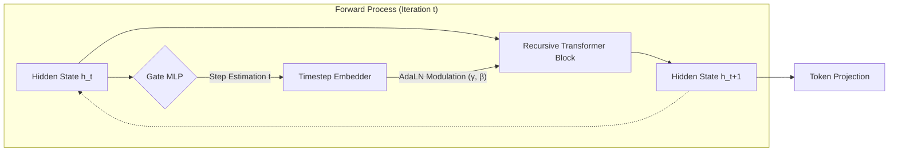

# RDT: Recursive Denoising Transformer

> **An Iterative Text Refinement Framework via Diffusion-inspired Recursive Computation**

[](https://opensource.org/licenses/MIT)
[](https://www.python.org/downloads/)
[](https://pytorch.org/)

## 📄 Abstract

**Recursive Denoising Transformer (RDT)** proposes a novel architecture that bridges the gap between **Autoregressive Transformers** and **Denoising Diffusion Models**. Unlike traditional models that process input in a single pass, RDT employs a **state-aware recursive mechanism** to iteratively refine corrupted text representations.

By leveraging **Adaptive Layer Normalization (AdaLN)** conditioned on self-estimated timesteps, RDT dynamically modulates its computation path. This allows for parameter-efficient deep computation and continuous state refinement, enabling the model to reconstruct complex semantic structures from heavily masked inputs through successive iterations.

---

## 🧩 Methodology

### 1. The Recursive Diffusion Process

The core philosophy of RDT is to treat text generation as a reverse diffusion process ($s_0 \to s_1 \dots \to s_L$), where $s_0$ represents a highly corrupted state and $s_L$ represents the fully restored sequence.

Instead of stacking distinct layers $L_1 \dots L_N$, RDT utilizes a **Shared Recursive Encoder** $\mathcal{F}_\theta$ that is applied repeatedly:

$$ h*{t+1} = \mathcal{F}*\theta(h_t, \text{Emb}(t)) $$

Where $h_t$ is the hidden state at step $t$, and $\text{Emb}(t)$ is the sinusoidal embedding of the current timestep.

### 2. Model Architecture

The architecture integrates concepts from **DiT (Diffusion Transformers)** into a recursive NLP framework.



#### A. Adaptive Layer Normalization (AdaLN)

To effectively reuse weights across different denoising stages, the model must understand "time". We employ **AdaLN** to zero-initialize the control of the residual block and dynamically shift feature statistics based on the noise level:

$$ \text{AdaLN}(x, t) = (1 + \gamma(t)) \cdot \text{LayerNorm}(x) + \beta(t) $$

This allows the same physical layers to perform coarse structural repairs at early steps and fine-grained detailing at later steps.

#### B. Self-Regulated Gating Mechanism

RDT includes a lightweight **Gate MLP** that acts as an internal clock. It diagnoses the current entropy of the hidden state to predict the restoration progress (timestep $t$). This prediction is fed back into the next iteration as a condition, making the inference process autonomous.

---

## 📉 Optimization Objectives

The model is trained using a multi-task objective function to ensure structural integrity and temporal coherence:

$$ \mathcal{L}_{total} = \mathcal{L}_{recon} + \lambda*{gate}\mathcal{L}*{gate} + \lambda*{aux}\mathcal{L}*{latent} $$

1.  **Reconstruction Loss ($\mathcal{L}_{recon}$)**: Cross-Entropy loss for token prediction at each step.
2.  **Gate Loss ($\mathcal{L}_{gate}$)**: MSE loss ensuring the Gate MLP accurately estimates the ground-truth timestep.
3.  **Latent Consistency Loss ($\mathcal{L}_{latent}$)**: Enforces the hidden state trajectory to remain consistent with the ground-truth restoration path.

---

## 🛠️ Installation

```bash
git clone https://github.com/yourusername/rdt.git
cd rdt
pip install -e .
```

**Check compatibility:**

```bash
python check_compatibility.py
```

**Setup Weights & Biases (W&B) for experiment tracking:**

```bash
# Login to W&B (first time only)
wandb login

# Or disable W&B by adding to your config:
# use_wandb: false
```

## 🚀 Quick Start

### Training RDT

Train RDT model with the unified training script:

```bash
# Train RDT (default)
rdt-train --config rdt/configs/base.yaml

# Train with custom settings
rdt-train --config rdt/configs/experiment.yaml --output_dir ./outputs
```

### Training Baseline Models

Train BERT or RoBERTa baselines using the same data pipeline:

```bash
# Train RoBERTa baseline
rdt-train --config rdt/configs/roberta_baseline.yaml

# Train BERT baseline
rdt-train --config rdt/configs/bert_baseline.yaml
```

### Evaluation

Evaluate trained models:

```bash
# Evaluate any model (auto-detects RDT vs MLM)
rdt-evaluate --checkpoint checkpoints/best_model.pt --config rdt/configs/base.yaml

# Evaluate on specific dataset
rdt-evaluate --checkpoint checkpoints/best_model.pt --config rdt/configs/base.yaml --dataset wikitext-2
```

### Inference (Iterative Denoising)

Run inference with RDT's adaptive stopping mechanism:

```bash
python rdt/scripts/inference.py \
    --checkpoint checkpoints/best_model.pt \
    --config rdt/configs/base.yaml \
    --text "The quick brown [MASK] jumps over the lazy [MASK]." \
    --threshold 0.02
```

### Testing

Quick model verification:

```bash
# Test model implementation
python test_model.py

# Test masking behavior
python rdt/scripts/test_masking.py --config rdt/configs/base.yaml
```

## 📂 Project Structure

```
rdt/
├── models/              # Model architectures
│   ├── rdt_model.py        # RDT implementation (AdaLN, Gate MLP, Recursive blocks)
│   ├── baseline_models.py  # Baseline wrappers (BERT, RoBERTa)
│   └── bert_init.py        # BERT weight initialization
├── data/                # Data loading and processing
│   ├── datasets.py         # StreamingTextDataset, WikiTextDataset
│   └── collators.py        # Data collators (RDT chains, MLM masking)
├── training/            # Training logic
│   ├── rdt_trainer.py      # RDT trainer (multi-objective loss)
│   └── baseline_trainer.py # Standard MLM trainer
├── evaluation/          # Evaluation tools
│   ├── metrics.py          # Perplexity, accuracy, top-k metrics
│   └── evaluator.py        # Unified evaluation interface
├── scripts/             # Runnable scripts
│   ├── train.py            # Unified training script (RDT + baselines)
│   ├── evaluate.py         # Evaluation script
│   ├── inference.py        # Interactive inference
│   ├── test_masking.py     # Masking behavior tests
│   └── test_bert.py        # BERT compatibility tests
├── configs/             # Configuration files
│   ├── base.yaml           # RDT config
│   ├── experiment.yaml     # RDT experiment config
│   ├── roberta_baseline.yaml  # RoBERTa config
│   └── bert_baseline.yaml  # BERT config
└── utils.py             # Shared utilities

Root files:
├── test_model.py        # Quick model tests
├── check_compatibility.py  # Dependency checker
└── pyproject.toml       # Package configuration
```

### Key Components

- **`models/rdt_model.py`**: Core RDT architecture with DirectionalRecursiveBlock and AdaLN
- **`data/datasets.py`**: Streaming data pipeline with chain trajectory generation
- **`training/rdt_trainer.py`**: Multi-objective training (reconstruction + gate + latent consistency)
- **`evaluation/evaluator.py`**: Unified evaluation for both RDT and baseline models
- **`scripts/train.py`**: Single entry point for training any model type

## 📊 Logging and Results

### Training Logs

Training automatically generates CSV logs alongside W&B tracking:

```bash
# Logs saved to outputs/logs/train_YYYYMMDD_HHMMSS.csv
rdt-train --config rdt/configs/base.yaml
```

**Log contents**: epoch, step, loss, recon_loss, gate_loss, aux_loss, lr, val_loss, etc.

### Evaluation Results

Evaluation saves detailed results as JSON:

```bash
# Save to custom path
rdt-evaluate --checkpoint checkpoints/best_model.pt \
             --config rdt/configs/base.yaml \
             --output outputs/results/eval_results.json
```

**Result format**:

```json
{
  "timestamp": "2024-12-15T10:30:00",
  "model_type": "rdt",
  "results": {
    "loss": 2.34,
    "accuracy": 0.65,
    "perplexity": 10.38
  }
}
```

### Visualization

Generate plots from logs:

```bash
# Plot training curves
rdt-plot --log outputs/logs/train_20241215_103000.csv

# Compare multiple experiments
rdt-plot --compare outputs/results/rdt_eval.json \
                    outputs/results/roberta_eval.json \
         --output-dir outputs/visualizations
```

**Generated plots**:

- `training_curves.png`: Loss, accuracy, learning rate over time
- `comparison.png`: Side-by-side model comparison

## � Experiment Tracking with W&B

RDT uses [Weights & Biases](https://wandb.ai/) for experiment tracking and visualization.

### Setup

```bash
# Install W&B
pip install wandb

# Login (first time only)
wandb login
```

### Configuration

Add W&B settings to your config file (e.g., `rdt/configs/base.yaml`):

```yaml
use_wandb: true # Enable/disable W&B (default: true)
wandb_project: "rdt" # Your W&B project name
wandb_run_name: "experiment-1" # Optional: custom run name
```

### What gets tracked:

- **Training metrics**: loss, reconstruction loss, gate loss, auxiliary loss
- **Learning rate**: current learning rate and scheduler state
- **Validation metrics**: perplexity, accuracy, top-k accuracy
- **Model architecture**: automatic model graph and gradients
- **Hardware usage**: GPU utilization, memory, system metrics

### Disable W&B

To train without W&B:

```yaml
use_wandb: false
```

Or use environment variable:

```bash
export WANDB_MODE=disabled
rdt-train --config rdt/configs/base.yaml
```

## �📜 Citation

If you find this code useful for your research, please cite:

```bibtex
@misc{rdt2024,
  title={RDT: Recursive Denoising Transformer with Adaptive Computation},
  author={RDT Contributors},
  year={2024},
  publisher={GitHub},
  howpublished={\url{https://github.com/yourusername/rdt}}
}
```

## 📄 License

This project is licensed under the MIT License. See the [LICENSE](LICENSE) file for details.
