# RDT: Recursive Denoising Transformer

> **An Iterative Text Refinement Framework via Diffusion-inspired Recursive Computation**

[](https://opensource.org/licenses/MIT)
[](https://www.python.org/downloads/)
[](https://pytorch.org/)

## 📄 Abstract

**Recursive Denoising Transformer (RDT)** proposes a novel architecture that bridges the gap between **Autoregressive Transformers** and **Denoising Diffusion Models**. Unlike traditional models that process input in a single pass, RDT employs a **state-aware recursive mechanism** to iteratively refine corrupted text representations.

By leveraging **Adaptive Layer Normalization (AdaLN)** conditioned on self-estimated timesteps, RDT dynamically modulates its computation path. This allows for parameter-efficient deep computation and continuous state refinement, enabling the model to reconstruct complex semantic structures from heavily masked inputs through successive iterations.

---

## 🧩 Methodology

### 1. The Recursive Diffusion Process

The core philosophy of RDT is to treat text generation as a reverse diffusion process ($s_0 \to s_1 \dots \to s_L$), where $s_0$ represents a highly corrupted state and $s_L$ represents the fully restored sequence.

Instead of stacking distinct layers $L_1 \dots L_N$, RDT utilizes a **Shared Recursive Encoder** $\mathcal{F}_\theta$ that is applied repeatedly:

$$ h*{t+1} = \mathcal{F}*\theta(h_t, \text{Emb}(t)) $$

Where $h_t$ is the hidden state at step $t$, and $\text{Emb}(t)$ is the sinusoidal embedding of the current timestep.

### 2. Model Architecture

The architecture integrates concepts from **DiT (Diffusion Transformers)** into a recursive NLP framework.

```mermaid
graph LR
    subgraph "Forward Process (Iteration t)"
        Input[Hidden State h_t] --> Gate{Gate MLP}
        Gate --"Step Estimation t"--> Time[Timestep Embedder]

        Input --> Block[Recursive Transformer Block]
        Time --"AdaLN Modulation (γ, β)"--> Block

        Block --> Output[Hidden State h_t+1]
    end

    Output -.-> Input
    Output --> Decoder[Token Projection]
```



#### A. Adaptive Layer Normalization (AdaLN)

To effectively reuse weights across different denoising stages, the model must understand "time". We employ **AdaLN** to zero-initialize the control of the residual block and dynamically shift feature statistics based on the noise level:

$$ \text{AdaLN}(x, t) = (1 + \gamma(t)) \cdot \text{LayerNorm}(x) + \beta(t) $$

This allows the same physical layers to perform coarse structural repairs at early steps and fine-grained detailing at later steps.

#### B. Self-Regulated Gating Mechanism

RDT includes a lightweight **Gate MLP** that acts as an internal clock. It diagnoses the current entropy of the hidden state to predict the restoration progress (timestep $t$). This prediction is fed back into the next iteration as a condition, making the inference process autonomous.

---

## 📉 Optimization Objectives

The model is trained using a multi-task objective function to ensure structural integrity and temporal coherence:

$$ \mathcal{L}_{total} = \mathcal{L}_{recon} + \lambda*{gate}\mathcal{L}*{gate} + \lambda*{aux}\mathcal{L}*{latent} $$

1.  **Reconstruction Loss ($\mathcal{L}_{recon}$)**: Cross-Entropy loss for token prediction at each step.
2.  **Gate Loss ($\mathcal{L}_{gate}$)**: MSE loss ensuring the Gate MLP accurately estimates the ground-truth timestep.
3.  **Latent Consistency Loss ($\mathcal{L}_{latent}$)**: Enforces the hidden state trajectory to remain consistent with the ground-truth restoration path.

---

## 🛠️ Installation

```bash
git clone https://github.com/yourusername/rdt.git
cd rdt
pip install -e .
```

## 🚀 Experiments & Usage

### Training

Train the model on streaming datasets (e.g., WikiText, BookCorpus) with the dynamic chain generation pipeline.

```bash
# Train with default hyperparameters
rdt-train --config configs/train_config.yaml
```

### Inference (Iterative Denoising)

Perform inference where the model recursively refines the input until the Gate mechanism signals completion.

```bash
rdt-inference \
    --model_path checkpoints/best_model.pt \
    --text "The quick brown [MASK] jumps over the lazy [MASK]." \
    --threshold 0.02
```

## 📂 Repository Structure

- `rdt/model.py`: Implementation of **DirectionalRecursiveBlock** and **AdaLN**.
- `rdt/data.py`: Streaming data loader for generating noise-chain trajectories.
- `rdt/trainer.py`: Training loop implementing the multi-objective loss landscape.
- `configs/`: Hyperparameter configurations for varying model scales.

## 📜 Citation

If you find this code useful for your research, please cite:

```bibtex
@misc{rdt2024,
  title={RDT: Recursive Denoising Transformer with Adaptive Computation},
  author={RDT Contributors},
  year={2024},
  publisher={GitHub},
  howpublished={\url{https://github.com/yourusername/rdt}}
}
```

## 📄 License

This project is licensed under the MIT License. See the [LICENSE](LICENSE) file for details.
