# RDT: Recursive Denoising Transformer

> **An Iterative Text Refinement Framework via Latent Space Denoising**

[](https://opensource.org/licenses/MIT)
[](https://www.python.org/downloads/)
[](https://pytorch.org/)
[]()

**Recursive Denoising Transformer (RDT)** proposes a novel architecture that bridges the gap between **Autoregressive Transformers** and **Latent Diffusion Models**. Unlike traditional BERT-like models that attempt to reconstruct corrupted tokens directly in a single pass, RDT separates the generation process into **Latent Mapping** and **Latent Denoising**.

RDT operates on the insight that while text masking is a discrete and non-differentiable operation, the underlying semantic manifold is smooth. By projecting discrete corruptions into a continuous latent space, RDT transforms the "token prediction" problem into a simpler "vector field estimation" problem. Using a state-aware recursive mechanism and **Adaptive Layer Normalization (AdaLN)**, the model iteratively purifies hidden representations, allowing for parameter-efficient deep computation and robust reconstruction of complex semantic structures.

---

## 🧩 Methodology

### 1. Discrete Corruption, Continuous Refinement

Traditional MLMs struggle because they mix the burden of "understanding syntax" and "predicting discrete tokens" in every layer. RDT decouples these responsibilities:

1.  **Interface (I/O Encoders)**: Defines the topology of the latent manifold. It handles the translation between discrete tokens and continuous embeddings.
2.  **Engine (Recursive Block)**: Focuses solely on **Manifold Projection**. It learns a vector field that moves points from "noisy regions" back to the "semantic manifold center" ($h_{noisy} \to h_{clean}$).

$$
h_{t+1} = \mathcal{F}_\theta(h_t, \text{Emb}(g_t))
$$

### 2. Model Architecture

The inference process resembles a **Latent Diffusion** trajectory, but specifically adapted for discrete text via recursive computation.

```mermaid
graph LR
    subgraph "Interface (Token Space)"
        Input[Corrupted Tokens]
        Output[Refined Tokens]
    end

    subgraph "Recursive Engine (Latent Space)"
        H_in((h_t)) --> Norm[Input Norm]
        Norm --> Gate{Gate MLP}

        Gate --"Noise Level (t)"--> Time[Timestep Embedder]
        Time --"AdaLN Modulation (γ, β)"--> Block[Recursive Denoising Block]

        H_in --> Block
        Block --> H_out((h_t+1))
    end

    Input --"Input Encoder"--> H_in
    H_out --"Output Decoder"--> Output
    H_out -."Recursion Loop".-> H_in
```



#### A. Adaptive Layer Normalization (AdaLN)
To effectively reuse weights across different denoising stages, the model injects timestep information directly into the normalization layers. The affine parameters are dynamically generated based on the Gate's output:

$$ \text{AdaLN}(x, t) = (1 + \gamma(t)) \cdot \text{LayerNorm}(x) + \beta(t) $$

We utilize a **Zero-Initialization** strategy for $\gamma$ and $\beta$, ensuring that the recursive block starts as an identity function and gradually learns to modulate features as training progresses.

#### B. Self-Regulated Gating Mechanism
RDT includes a lightweight **Gate MLP** that acts as an internal clock. It diagnoses the entropy of the current hidden state to predict the restoration progress ($g_t$).
*   **Residual Prediction**: The gate predicts the *decrease* in noise ($\Delta$) rather than the absolute value ($g_{t+1} = g_t - \Delta$), ensuring a monotonically decreasing trajectory.
*   **Adaptive Stopping**: During inference, the recursion terminates automatically when the gate score drops below a threshold.

---

## 📉 Optimization Objectives

The model is trained using a multi-task objective function ($ \mathcal{L}_{total} $) that enforces structural integrity and temporal coherence in the latent space.

$$ \mathcal{L}_{total} = \mathcal{L}_{recon} + \lambda_{gate}\mathcal{L}_{gate} + \lambda_{latent}\mathcal{L}_{latent} $$

| Component | Symbol | Description |
| :--- | :---: | :--- |
| **Reconstruction** | $\mathcal{L}_{recon}$ | Cross-Entropy loss applied to the final logits. Ensures the final latent representation decodes into correct tokens. |
| **Gate Consistency** | $\mathcal{L}_{gate}$ | MSE loss ensuring the Gate MLP accurately estimates the ground-truth restoration percentage ($s_{GT}$). |
| **Latent Consistency** | $\mathcal{L}_{latent}$ | **The Core Constraint.** We minimize the distance between the recursive state $h_t$ and the "ideal" state encoded from the ground-truth text by the Input Encoder.<br>$$ || h_{pred}^{(t)} - \text{Encoder}(x_{target}) ||^2 $$<br>This acts as **"Teacher Forcing" in the latent space**, simplifying the learning landscape. |

---

## 📂 Project Structure

The project is organized to clearly separate the neural architecture, training logic, and data pipeline.

```bash
rdt/
├── models/              # Core Neural Architectures
│   ├── rdt_model.py        # RDT Implementation (AdaLN, Gate MLP, Recursive Blocks)
│   ├── baseline_models.py  # Wrappers for BERT/RoBERTa baselines
│   └── bert_init.py        # Weight initialization utilities
│
├── training/            # Training Logic
│   ├── rdt_trainer.py      # RDT Trainer (Latent Consistency + Gate Loss)
│   │   └── Scheduled Sampling # Curriculum learning (GT -> Predicted Gate)
│   └── baseline_trainer.py # Standard MLM Trainer
│
├── data/                # Data Pipeline
│   ├── datasets.py         # StreamingTextDataset
│   └── collators.py        # Chain generation ($s_0 \to s_L$) & Masking
│
├── scripts/             # CLI Entry Points
│   ├── train.py            # Unified training script
│   ├── evaluate.py         # Evaluation script
│   ├── inference.py        # Interactive Recursive Inference
│   └── test_masking.py     # Noise injection testing
│
├── configs/             # Hyperparameter Configurations
│   ├── base.yaml           # Default RDT configuration
│   └── experiment.yaml     # Experimental setups
│
└── utils.py             # Logging & Checkpointing utilities
```

---

## 🛠️ Installation

```bash
# Clone the repository
git clone https://github.com/YeoJune/rdt.git
cd rdt

# Install dependencies (Editable mode)
pip install -e .
```

**Requirements:**
- Python 3.8+
- PyTorch 2.0+ (with CUDA support recommended)
- WandB (Optional, for experiment tracking)

---

## 🚀 Usage

### 1. Training
Train the RDT model using the unified training script. The trainer supports **Scheduled Sampling**, transitioning from Ground-Truth timestamps (Early Training) to Predicted Gate scores (Late Training) to bridge the exposure bias gap.

```bash
# Train with default configuration (Epoch-based)
rdt-train --config rdt/configs/base.yaml

# Train with specific experiment settings (Step-based)
rdt-train --config rdt/configs/experiment.yaml --output_dir ./outputs/exp_01
```

### 2. Inference (Iterative Denoising)
Run inference to observe the recursive restoration process. The model uses the **Adaptive Stopping** mechanism to determine when the text is fully restored.

```bash
python rdt/scripts/inference.py \
    --checkpoint checkpoints/best_model.pt \
    --text "The quick brown [MASK] jumps over the lazy [MASK]." \
    --threshold 0.02
```

**Output Example:**
```text
Step 0 (Gate: 1.00): The quick brown [MASK] jumps over the lazy [MASK].
Step 1 (Gate: 0.45): The quick brown fox jumps over the lazy [MASK].
Step 2 (Gate: 0.01): The quick brown fox jumps over the lazy dog.
> Terminated (Threshold < 0.02)
```

### 3. Evaluation
Evaluate the model's Perplexity (PPL) and Reconstruction Accuracy on standard benchmarks.

```bash
rdt-evaluate --checkpoint checkpoints/best_model.pt --dataset wikitext-2
```

---

## 📊 Performance & Logging

RDT integrates with **Weights & Biases (W&B)** for real-time experiment tracking.

*   **Training Metrics**: Loss (Total, Recon, Gate, Latent), Learning Rate, Sampling Probability.
*   **Validation Metrics**: Accuracy, Perplexity, Gate Error.
*   **Visualizations**: Gate score trajectories, Latent space convergence analysis.

To enable W&B, set `use_wandb: true` in your `configs/base.yaml`.

## 📜 Citation

If you find this code or architecture useful for your research, please cite:

```bibtex
@misc{rdt2025,
  title={RDT: Recursive Denoising Transformer via Latent Space Refinement},
  author={Yeo Joon},
  year={2025},
  publisher={GitHub},
  journal={arXiv preprint},
  howpublished={\url{https://github.com/YeoJune/rdt}}
}
```

## 📄 License

This project is licensed under the MIT License. See the [LICENSE](LICENSE) file for details.
