# RDT: Recursive Denoising Transformer

> **An Iterative Text Refinement Framework via Latent Space Denoising**

[](https://opensource.org/licenses/MIT)
[](https://www.python.org/downloads/)
[](https://pytorch.org/)
[]()

**Recursive Denoising Transformer (RDT)** proposes a novel architecture that bridges the gap between **Autoregressive Transformers** and **Latent Diffusion Models**. Unlike traditional BERT-like models that attempt to reconstruct corrupted tokens directly in a single pass, RDT separates the generation process into **Latent Mapping** and **Latent Denoising**.

RDT operates on the insight that while text masking is a discrete and non-differentiable operation, the underlying semantic manifold is smooth. By projecting discrete corruptions into a continuous latent space, RDT transforms the "token prediction" problem into a simpler "vector field estimation" problem. Using a state-aware recursive mechanism and **Adaptive Layer Normalization (AdaLN)**, the model iteratively purifies hidden representations, allowing for parameter-efficient deep computation and robust reconstruction of complex semantic structures.

---

## 🧩 Methodology

### 1. Discrete Corruption, Continuous Refinement

Traditional MLMs struggle because they mix the burden of "understanding syntax" and "predicting discrete tokens" in every layer. RDT decouples these responsibilities:

1.  **Interface (I/O Encoders)**: Defines the topology of the latent manifold. It handles the translation between discrete tokens and continuous embeddings.
2.  **Engine (Recursive Block)**: Focuses solely on **Manifold Projection**. It learns a vector field that moves points from "noisy regions" back to the "semantic manifold center" ($h_{noisy} \to h_{clean}$).

$$
h_{t+1} = \mathcal{F}_\theta(h_t, \text{Emb}(g_t))
$$

### 2. Model Architecture

The inference process resembles a **Latent Diffusion** trajectory, but specifically adapted for discrete text via recursive computation.

```mermaid
graph LR
    subgraph "Interface (Token Space)"
        Input[Corrupted Tokens]
        Output[Refined Tokens]
    end

    subgraph "Recursive Engine (Latent Space)"
        H_in((h_t)) --> Norm[Input Norm]
        Norm --> Gate{Gate MLP}

        Gate --"Noise Level (t)"--> Time[Timestep Embedder]
        Time --"AdaLN Modulation (γ, β)"--> Block[Recursive Denoising Block]

        H_in --> Block
        Block --> H_out((h_t+1))
    end

    Input --"Input Encoder"--> H_in
    H_out --"Output Decoder"--> Output
    H_out -."Recursion Loop".-> H_in
```



#### A. Adaptive Layer Normalization (AdaLN)

To effectively reuse weights across different denoising stages, the model injects timestep information directly into the normalization layers. The affine parameters are dynamically generated based on the Gate's output:

$$ \text{AdaLN}(x, t) = (1 + \gamma(t)) \cdot \text{LayerNorm}(x) + \beta(t) $$

We utilize a **Zero-Initialization** strategy for $\gamma$ and $\beta$, ensuring that the recursive block starts as an identity function and gradually learns to modulate features as training progresses.

#### B. Self-Regulated Gating Mechanism

RDT includes a lightweight **Gate MLP** that acts as an internal clock. It diagnoses the entropy of the current hidden state to predict the restoration progress ($g_t$).

- **Residual Prediction**: The gate predicts the _decrease_ in noise ($\Delta$) rather than the absolute value ($g_{t+1} = g_t - \Delta$), ensuring a monotonically decreasing trajectory.
- **Adaptive Stopping**: During inference, the recursion terminates automatically when the gate score drops below a threshold.

---

## 📉 Optimization Objectives

The model is trained using a multi-task objective function ($ \mathcal{L}\_{total} $) that enforces structural integrity and temporal coherence in the latent space.

$$ \mathcal{L}_{total} = \mathcal{L}_{recon} + \lambda*{gate}\mathcal{L}*{gate} + \lambda*{latent}\mathcal{L}*{latent} $$

| Component              |         Symbol         | Description                                                                                                                                                              |
| :--------------------- | :--------------------: | :----------------------------------------------------------------------------------------------------------------------------------------------------------------------- | --- | ------------------------------------------- | --- | ---------------------------------------------------------------------------------------------------- |
| **Reconstruction**     | $\mathcal{L}_{recon}$  | Cross-Entropy loss applied to the final logits. Ensures the final latent representation decodes into correct tokens.                                                     |
| **Gate Consistency**   |  $\mathcal{L}_{gate}$  | MSE loss ensuring the Gate MLP accurately estimates the ground-truth restoration percentage ($s_{GT}$).                                                                  |
| **Latent Consistency** | $\mathcal{L}_{latent}$ | **The Core Constraint.** We minimize the distance between the recursive state $h_t$ and the "ideal" state encoded from the ground-truth text by the Input Encoder.<br>$$ |     | h*{pred}^{(t)} - \text{Encoder}(x*{target}) |     | ^2 $$<br>This acts as **"Teacher Forcing" in the latent space**, simplifying the learning landscape. |

---

## 📂 Project Structure

The project is organized to clearly separate the neural architecture, training logic, and data pipeline.

```bash
rdt/
├── models/              # Core Neural Architectures
│   ├── __init__.py
│   ├── rdt.py              # RDT Implementation (RoPE, MLP I/O, AdaLN, Gate MLP)
│   ├── mlm.py              # MLM Wrapper for BERT/RoBERTa (single-pass)
│   ├── cmlm.py             # Conditional MLM (Mask-Predict, confidence-based)
│   ├── mdlm.py             # Masked Diffusion LM (SUBS parameterization)
│   └── bert_init.py        # Pretrained weight initialization utilities
│
├── training/            # Training Logic
│   ├── __init__.py
│   ├── rdt_trainer.py      # RDT Trainer (Latent Consistency + Gate Loss)
│   │                       #   with Scheduled Sampling for gate predictions
│   └── mlm_trainer.py      # Unified Trainer for MLM/CMLM/MDLM baselines
│
├── data/                # Data Pipeline
│   ├── __init__.py
│   ├── datasets.py         # StreamingTextDataset & WikiTextDataset
│   └── collators.py        # RDTCollator, MLMCollator (masking & chain generation)
│
├── evaluation/          # Evaluation Tools
│   ├── __init__.py
│   ├── evaluator.py        # Unified evaluator for RDT/MLM/CMLM/MDLM
│   └── metrics.py          # Perplexity, Accuracy calculations
│
├── scripts/             # CLI Entry Points
│   ├── __init__.py
│   ├── train.py            # Unified training script (RDT/MLM/CMLM/MDLM)
│   ├── evaluate.py         # Model evaluation script
│   ├── inference.py        # Interactive inference for all models
│   ├── test_masking.py     # Masking sensitivity analysis
│   └── plot_training.py    # Training metrics visualization
│
├── configs/             # Hyperparameter Configurations
│   ├── __init__.py
│   ├── rdt.yaml            # RDT configuration (recursive denoising)
│   ├── mlm.yaml            # MLM baseline (BERT-style single-pass)
│   ├── cmlm.yaml           # CMLM baseline (iterative mask-predict)
│   └── mdlm.yaml           # MDLM baseline (diffusion-based generation)
│
├── utils.py             # Main utility functions (config, checkpoint, etc.)
└── __init__.py          # Package initialization
```

---

## 🛠️ Installation

```bash
# Clone the repository
git clone https://github.com/YeoJune/rdt.git
cd rdt

# Install dependencies (Editable mode for development)
pip install -e .

# Or install with development tools (pytest, black, flake8, isort)
pip install -e ".[dev]"
```

**Requirements:**

- Python 3.8+
- PyTorch 2.0+ (with CUDA support recommended)
- All dependencies are defined in `pyproject.toml` and installed automatically

---

## 🚀 Usage

### 1. Training

Train RDT, MLM, or CMLM models using the unified training script. The RDT trainer supports **Scheduled Sampling**, transitioning from Ground-Truth gate scores to Predicted gate scores to reduce exposure bias.

```bash
# Train RDT (Recursive Denoising Transformer)
rdt-train --config rdt/configs/rdt.yaml

# Train MLM baseline (BERT-style single-pass)
rdt-train --config rdt/configs/mlm.yaml

# Train CMLM baseline (iterative mask-predict)
rdt-train --config rdt/configs/cmlm.yaml

# Train MDLM baseline (diffusion-based generation)
rdt-train --config rdt/configs/mdlm.yaml

# Resume from checkpoint (all models)
rdt-train --config rdt/configs/rdt.yaml --checkpoint ./checkpoints/rdt/checkpoint_epoch_5.pt

# Load pretrained weights only (start training from scratch)
rdt-train --config rdt/configs/mlm.yaml --pretrained ./checkpoints/mlm/best_model.pt
```

### 2. Inference

Run inference with any trained model (RDT/MLM/CMLM). RDT uses **Adaptive Stopping** based on gate scores for efficient computation.

```bash
# Interactive mode - RDT (recursive denoising)
rdt-inference --checkpoint checkpoints/rdt/best_model.pt --config rdt/configs/rdt.yaml --interactive

# Interactive mode - MLM (single-pass)
rdt-inference --checkpoint checkpoints/mlm/best_model.pt --config rdt/configs/mlm.yaml --interactive

# Interactive mode - CMLM (iterative mask-predict)
rdt-inference --checkpoint checkpoints/cmlm/best_model.pt --config rdt/configs/cmlm.yaml --interactive

# Interactive mode - MDLM (diffusion sampling)
rdt-inference --checkpoint checkpoints/mdlm/best_model.pt --config rdt/configs/mdlm.yaml --interactive

# Single text inference - RDT
rdt-inference --checkpoint checkpoints/rdt/best_model.pt --config rdt/configs/rdt.yaml \
    --text "The quick brown [MASK] jumps over the lazy [MASK]." \
    --max-steps 10 --threshold 0.05

# Single text inference - MLM (single pass)
rdt-inference --checkpoint checkpoints/mlm/best_model.pt --config rdt/configs/mlm.yaml \
    --text "The capital of France is [MASK]."

# Single text inference - CMLM (iterative refinement)
rdt-inference --checkpoint checkpoints/cmlm/best_model.pt --config rdt/configs/cmlm.yaml \
    --text "The quick brown [MASK] jumps over the lazy [MASK]." \
    --max-iterations 10

# Single text inference - MDLM (diffusion sampling)
rdt-inference --checkpoint checkpoints/mdlm/best_model.pt --config rdt/configs/mdlm.yaml \
    --text "The quick brown [MASK] jumps over the lazy [MASK]." \
    --num-steps 1000 --sampler ddpm_cache
```

**RDT Output Example:**

```text
[Step 0] Gate: 1.000 | The quick brown [MASK] jumps over the lazy [MASK].
[Step 1] Gate: 0.782 | The quick brown fox jumps over the lazy [MASK].
[Step 2] Gate: 0.234 | The quick brown fox jumps over the lazy dog.
[Step 3] Gate: 0.043 | The quick brown fox jumps over the lazy dog.
✓ Completed in 3 steps (Gate < 0.05)
```

**Model Comparison:**

| Model    | Method              | Key Feature                           | Inference Steps  |
| -------- | ------------------- | ------------------------------------- | ---------------- |
| **RDT**  | Recursive denoising | Gate-based adaptive stopping          | Variable (1-20)  |
| **MLM**  | Single-pass         | Direct token prediction               | Fixed (1)        |
| **CMLM** | Mask-predict        | Confidence-based iterative refinement | Fixed (10-15)    |
| **MDLM** | Diffusion           | Random remasking with cosine schedule | Fixed (100-1000) |

### 3. Evaluation

Evaluate model performance on standard benchmarks. Supports accuracy, BLEU, and BERTScore metrics.

```bash
# Evaluate RDT model
rdt-evaluate --config rdt/configs/rdt.yaml --checkpoint checkpoints/rdt/best_model.pt \
    --split test --max-steps 20 --threshold 0.02

# Evaluate MLM baseline
rdt-evaluate --config rdt/configs/mlm.yaml --checkpoint checkpoints/mlm/best_model.pt \
    --split test

# Evaluate CMLM baseline
rdt-evaluate --config rdt/configs/cmlm.yaml --checkpoint checkpoints/cmlm/best_model.pt \
    --split test --max-iterations 10

# Evaluate MDLM baseline
rdt-evaluate --config rdt/configs/mdlm.yaml --checkpoint checkpoints/mdlm/best_model.pt \
    --split test --num-steps 1000 --sampler ddpm_cache

# Masking sensitivity analysis (all models)
rdt-test-masking --config rdt/configs/rdt.yaml --checkpoint checkpoints/rdt/best_model.pt \
    --num-samples 100

rdt-test-masking --config rdt/configs/mdlm.yaml --checkpoint checkpoints/mdlm/best_model.pt \
    --num-samples 100
```

**Available Commands:**

- `rdt-train` - Train models (RDT/MLM/CMLM/MDLM)
- `rdt-evaluate` - Evaluate trained models on test datasets
- `rdt-inference` - Interactive or single-text inference for all models
- `rdt-test-masking` - Analyze reconstruction performance across masking ratios
- `rdt-plot` - Visualize training metrics from CSV logs

---

## 📊 Performance & Logging

RDT integrates with **Weights & Biases (W&B)** for real-time experiment tracking.

- **Training Metrics**: Loss (Total, Recon, Gate, Latent), Learning Rate, Sampling Probability.
- **Validation Metrics**: Accuracy, Perplexity, Gate Error.
- **Visualizations**: Gate score trajectories, Latent space convergence analysis.

To enable W&B, set `use_wandb: true` in your `configs/base.yaml`.

## 📜 Citation

If you find this code or architecture useful for your research, please cite:

```bibtex
@misc{rdt2025,
  title={RDT: Recursive Denoising Transformer via Latent Space Refinement},
  author={Yeo Joon},
  year={2025},
  publisher={GitHub},
  journal={arXiv preprint},
  howpublished={\url{https://github.com/YeoJune/rdt}}
}
```

## 📄 License

This project is licensed under the MIT License. See the [LICENSE](LICENSE) file for details.
